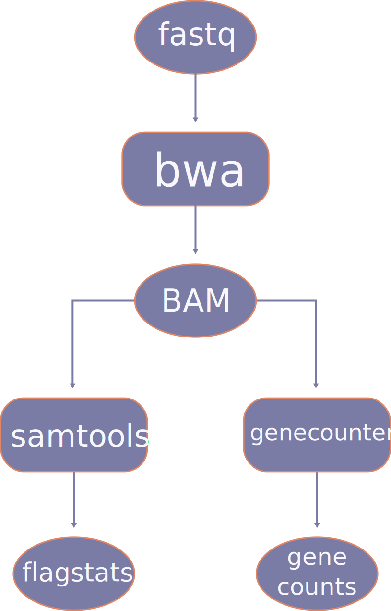

Building Pipelines
==================

Dependency Workflow Concepts
^^^^^^^^^^^^^^^^^^^^^^^^^^^^

Operon pipelines don't actually run anything at all; instead, they define a workflow. Parsl then uses the defined
workflow to run the pipeline in a highly-efficient and configuration manner. Operon simply acts as an abstraction to
Parsl so the developer need only what about what software needs to be run, and at what point in the pipeline it
has all the information it needs to run successfully.

There are two main components to a dependency workflow graph:

1. Executables
2. Data

Executables generally take input, perform some computational work on that input, then produce some output. Data is any
file on disk that is used as input or produced as output and that needs to be considered in the workflow graph.

When building a pipeline in Operon, the connections between Executables and Data need not be a part of the design
process. The developer needs only to define Executables which are a part of the workflow, and the input and/or output
files for each Executable. At runtime, Operon will examine the dependency workflow graph and feed the connections
appropriately into Parsl.

As an example, consider the following scenario in a bioinformatics workflow : a FASTQ file is used as input to an
aligner (say, bwa), which produces a BAM file. That produced BAM file needs to be used as input to two programs, one
to gather flagstats and one to quantify gene counts. The dependency workflow graph would look as follows:

|
The developer for this pipeline only needs to define the following:

* There's a program called bwa, which lives at ``/path/to/bwa``. As input, it takes in a file located at
  ``/path/to/fastq``, and as output it generates a file called ``/path/to/bam``.
* There's a program called samtools, which lives at ``/path/to/samtools``. As input, it takes in a file located at
  ``/path/to/bam``, and as output it generates a file called ``/path/to/flagstats``.
* There's a program called genecounter, which lives at ``/path/to/genecounter``. As input, it takes in a file located
  at ``/path/to/bam``, and as output it generates a file called ``/path/to/genecounts``.

This defines three Software instances (Apps in Parsl verbage): bwa, samtools, and genecounter. All three Software
instances have data dependencies; that is, they are require input data to run. However, two of the Software instances'
data dependencies are not yet available (because they haven't been produced by the pipeline yet), so they will not
run until those dependencies become available. The Software bwa, however, has all of its data dependencies available,
so it begins running immediately. Once bwa is finished running, and consequently produces its output ``/path/to/bam``,
the Software samtools and genecounter both recognize that their data dependencies are now available, and so both
begin running concurrently.

.. note::

    ``/path/to/fastq``, ``/path/to/bwa``, etc are placeholders in the above example. In a real pipeline, the
    developer would gather those values either from the command line via ``pipeline_args`` or from the configuration
    via ``pipeline_config``. As long as ``Data()`` inputs and outputs resolve to filesystem paths at the time of
    workflow generation, Parsl will be able to correctly determine data dependencies.

Pipeline Meta Definitions
^^^^^^^^^^^^^^^^^^^^^^^^^
Pipeline meta definitions describe how the pipeline should be installed, provisioned, and configured so that as little
as possible needs to be done by the user before the pipeline is ready to run on the user's platform.

All pipeline meta definitions (and logic, for that matter) is defined in a single document with a single class, always
called ``Pipeline``, which subclasses ``operon.components.ParslPipeline``.

.. code-block:: python

    from operon.components import ParslPipeline

    class Pipeline(ParslPipeline):
        def description(self):
            return 'An example pipeline'

        ...

        def pipeline(self, pipeline_args, pipeline_config):
            # Pipeline logic here

Description
###########
The description of the pipeline is a string meant to be a human readable overview of what the pipeline does and any
other relevant information for the user.

.. code-block:: python

    def description(self):
        return 'An example pipeline, written in Operon, powered by Parsl'

The pipeline description is displayed when the user runs ``operon show``.

Dependencies
############
Pipeline dependencies are Python packages which the pipeline logic use. Dependencies are provided as a list of strings,
where each string is the name of a package available on PyPI and suitable to be feed directly into ``pip``.

.. code-block:: python

    def dependencies(self):
        return [
            'pysam==0.13',
            'pyvcf'
        ]

Upon pipeline installation, the user is given the option to use ``pip`` to install dependencies into their current
Python environment. While this may be convenient, it may also cause package collisions or unecessary muddying of a
distribution Python environment, so the user can instead opt to get the dependencies from ``operon show`` and install
them manually into a Python virtual environment.

.. note::

    If the user accepts auto-installing dependencies into their current Python environment, ``pip`` will attempt to
    do so using the ``--upgrade`` flag. This may upgrade or downgrade packages already installed in the current
    Python environment if there are any collisions.

Conda/Bioconda
##############
Executables provided by Conda/Bioconda can be installed and injected into the user's pipeline configuration, provided
the user has Miniconda installed and in PATH. Executables are defined by a list of ``CondaPackage`` tuples, with the
option to override the default conda channels that Operon loads.

.. code-block:: python

    from operon.components import CondaPackage

    def conda(self):
        return {
            'channels': ['overriding', 'channels', 'here'],
            'packages': [
                CondaPackage(tag='star=2.4.2a', config_key='STAR', executable_path='bin/STAR'),
                CondaPackage(tag='picard', config_key='picard', executable_path='share/picard-2.15.0-0/picard.jar')
            ]
        }

If provided, ``channels`` will be loaded by Miniconda in list order, which means the last entry has the highest
precedence, the second-highest entry has the second-highest precedence, etc.

A ``CondaPackage`` named tuple takes the following keys:

* ``tag`` is the name of the executable and optional version number fed directly to Miniconda
* ``config_key`` is the outermost key in the pipeline's ``configuration()``. When this executable is injected into
  a user's pipeline config, it's placed into ``pipeline_config[config_key]['path']``
* ``executable_path`` is only necessary if the basename of the installed executable is different from the conda tag, or
  if the developer wishes to use an executable outside conda's default ``bin`` folder. Some examples:

    * The conda package ``star=2.4.2a`` is installed as ``STAR``, so ``executable_path=`` must be set to ``bin/STAR``
    * The conda package ``picard`` installs an executable into ``bin``, but if the developer wishes to access the
      jar file directly, she must set ``executable_path=`` to ``share/picard-2.15.0-0/picard.jar``
    * The conda package ``bwa`` installs an executable into ``bin`` called ``bwa``, so ``executable_path`` does not
      need to be set

To see which executables are offered by Bioconda, please refer to their `package index
<https://bioconda.github.io/recipes.html>`_.

Parsl Configuration
###################
A default Parsl configuration can be provided in the event the user doesn't provide any higher-precendence Parsl
configuration. The returned ``dict`` will be fed directly to Parsl before execution.

.. code-block:: python

    def parsl_configuration(self):
        return {
            'sites': [
                {
                    'site': 'Local_Threads',
                    'auth': {'channel': None},
                    'execution': {
                        'executor': 'threads',
                        'provider': None,
                        'max_workers': 4
                    }
                }
            ],
            'globals': {'lazyErrors': True}
        }

To better understand Parsl configuration, please refer to `their documentation
<http://parsl.readthedocs.io/en/latest/userguide/configuring.html>`_ on the subject.

.. note::

    This method of configuring Parsl has very low precedence, and that's on purpose. The user is given every
    opportunity to provide a configuration that works for her specific platform, so the configuration provided
    by the pipeline is only meant as a desperation-style "we don't have anything else" configuration.

Pipeline Configuration
######################
The pipeline configuration contains attributes passed into the pipeline logic which may change from platform to
platform, but generally won't change from run to run. For example, paths to executables for software, paths to
reference files, number of threads to use, etc will vary by platform but will be the same for every run.

.. code-block:: python

    def configuration(self):
        return {
            'software1': {
                'path': 'Full path to software1',
                'threads': 'Run software1 with this many threads',
                'threads': {
                    'q_type': 'list',
                    'message': 'Run software1 with this many threads',
                    'choices': ['1', '2', '4', '8', '16'],
                    'default': '4'
                }
            },
            'software2': {
                'path': 'Full path to software2',
                'genome_reference': {
                    'q_type': 'path',
                    'message': 'Path to genome reference'
                }
            }
        }

The returned configuration dictionary may nest arbitrarily deep. All values must be either a dictionary or a string.
Considering the configuration dictionary as a tree, there are two types of leaves: a string or a dictionary which
configures a question to the user. During configuration of the pipeline using ``operon configure``, the user is
presented with a prompt for each leaf, and the user input is gathered and stored in place of the prompt string.

.. note::

    The nesting of dictionaries inside the configuration dictionary is purely for the developer's organizational
    convenience; the user will never see anything but prompts defined by the string values.

    If the order of prompts is important, return a ``collections.OrderedDict`` instance.

For a string leaf, the question type defaults to a Text question, where the prompt presented is the string itself. The
exception to this is if the word ``path`` is found in the most immediate key, the question type will default to
``Path``.

For a dictionary leaf, the question type can be fully configured. For a dictionary to be recognized as a leaf, it must
contain the key ``q_type``, or else it will be interpreted as another level in the nested configuration dictionary. The
following options can be passed to a question configuration:

* ``q_type`` must be one of ``{path, text, confirm, list, checkbox, password}``
* ``message`` is the prompt displayed to the user
* ``default`` is a default value suggested to the user as part of the prompt
* ``validate`` is a function which determines whether the user input is valid
* ``ignore`` is a function which determines whether to display this question to the user
* ``choices`` is a list of choices; only used by the List and Checkbox question types
* ``always_default`` if present with any value, will force the default to always be the value defined by the key
  ``default``, regardless of whether another value was injected by Operon

The ``q_type`` and ``message`` keys are required for all question types, while the ``choices`` key is additionally
required for List and Checkbox question types. For more information on how each of the question types operate,
please refer to the
`inquirer documentation <http://python-inquirer.readthedocs.io/en/latest/usage.html#question-types>`_
on question types.

For the above example configuration, the user will see and interactively fill in the prompts:

.. code-block:: text

    $ operon configure pipeline-name
    [?] Full path to software1: (User enters) /path/to/soft1
    [?] Run software1 with this many threads: (User selects) 8
       1
       2
       4
     > 8
       16

    [?] Full path to software2: (User enters) /path/to/soft2
    [?] Path to genome reference: (User enters) /path/to/genome

The input from the user is stored in the ``.operon`` folder, so the next time the pipeline is run with this
configuration it will be made available in the ``pipeline_config`` parameter:

.. code-block:: python

    # Contents of pipeline_config
    {
        'software1': {
            'path': '/path/to/soft1',
            'threads': '8'
        },
        'software2': {
            'path': '/path/to/soft2',
            'genome_reference': '/path/to/genome'
        }
    }

So for any software which needs access to a genome reference, the path can be passed to the software as
``pipeline_config['software2']['genome_reference']``.

Pipeline Arguments
##################
The pipeline arguments are attributes that will change from run to run and are specified by the user as command line
arguments on a per-run basis. Pipeline arguments are added by modifying the ``argparse.ArgumentParser`` object passed
into ``self.arguments()``; refer to the `documentation <https://docs.python.org/3/library/argparse.html>`_ for
``argparse`` for futher details on how pipeline arguments can be gathered.

.. code-block:: python

    def arguments(self, parser):
        parser.add_argument('--output-dir', help='Path to output directory')
        parser.add_argument('--fastqs', nargs='*', help='Paths to all input fastq files')
        parser.add_argument('--run-name', default='run001', help='Name of this run')
        # Nothing needs to be returned since parser is modified in place

Added arguments are exposed to the user when running ``operon run``, according to the rules of the ``argparse`` module.

.. code-block:: text

    $ operon run pipeline -h
    > operon run pipeline [-h] [--output-dir OUTPUT_DIR] [--fastqs [FASTQS [FASTQS ...]]]
    >                     [--run-name RUN_NAME]
    >
    > Pipeline description is here
    >
    > optional arguments:
    >   -h, --help            show this help message and exit
    >   -c CONFIG, --config CONFIG
    >                         Path to a config file to use for this run.
    >   --output-dir OUTPUT_DIR
    >                         Path to output directory
    >   --fastqs [FASTQS [FASTQS ...]]
    >                         Paths to all input fastq files
    >   --run-name RUN_NAME   Name of this run
    >
    $ operon run pipeline --fastqs /path/to/fastq1.fq /path/to/fastq2.fq \
    >                     --output-dir /path/to/output --run-name run005

Populated arguments are made available to the pipeline as a dictionary in the ``pipeline_args`` parameter:

.. code-block:: python

    # Contents for pipeline_args
    {
        'fastqs': ['/path/to/fastq1.fq', '/path/to/fastq2.fq'],
        'output_dir': '/path/to/output',
        'run_name': 'run005'
    }

.. note::

    Parameters in ``argparse`` can have dashes in them (and should to separate words), but when converted to a Python
    dictionary dashes are replaced with underscores.

    Ex. ``--output-dir`` is accessed by ``pipeline_args['output_dir']``

Three pipeline arguments are always injected by Operon: ``--pipeline-config``, ``--parsl-config``, and ``--logs-dir``.
These arguments point to a pipeline config file to use for the run, a Parsl config file to use for the run, and a
directory in which to store log files, respectively.

Pipeline Logic
^^^^^^^^^^^^^^
Pipeline logic defines how the workflow dependency graph should be built. The work is done in the ``pipeline()``
method, which is given two parameters, ``pipeline_args`` and ``pipeline_config``, which are populated at runtime
with command line arguments from the user and the stored pipeline configuration file, respectively.

Executables and data are defined using a set of wrapper objects provided by Operon: this section details those
components and how to use them.

.. code-block:: python

    def pipeline(self, pipeline_args, pipeline_config):
        # All logic to build the workflow graph goes here

.. note::

    All the logic here is only to build the workflow dependency graph, which means that *none of the executables
    are being run and none of the data is being produced until after* ``pipeline()`` *has completed*. Parsl only begins
    actually running the software after it's been fed the generated workflow graph.

    All statements in the ``pipeline()`` method should be for generating the workflow graph, not handling or operating
    on data in any way. If needed, small blocks of Python can be written in a ``CodeBlock`` instance, which can be
    integrated into the workflow graph and so will execute at the correct time.

Data ``operon.components.Data``
###############################
A ``Data`` instance wraps a file on the filesystem and registers it as a data node in the workflow graph. Any file
that should be considered in the workflow graph needs to be wrapped in a ``Data`` instance; often this is only
input or output to an executable, and may not include output like log files.

When passed as an argument to a ``Parameter`` object, the data must be specified as either input or output by calling
either the ``.as_input()`` or ``.as_output()`` method. This distinction is not necessary when passing as a part of
``extra_inputs=`` or ``extra_outputs=`` keyword arguments.

``Data`` objects can be marked as temporary, which designates the underlying file on the filesystem to be deleted
at the end of the run, by setting the ``tmp=`` parameter to ``True`` in ``.as_output()``.

.. code-block:: python

    from operon.components import Data

    bwa.register(
        Parameter('--fastq', Data('/path/to/fastq.fq').as_input()),
        Parameter('--tmp-bam', Data('/path/to/tmp.bam').as_output(tmp=True)),
        Parameter('--persistent-bam', Data('/path/to/persistent.bam').as_output())
    )

    samtools.register(
        Parameter('--input-bam', Data('/path/to/persistent.bam').as_input())
    )

The developer does not need to keep track of individual ``Data`` instances because ``Data`` instances are uniquely
identified by the filesystem paths they wrap; that is, if a ``Data`` instance is created as ``Data('/path/to/file')``,
any subsequent calls to ``Data('/path/to/file')`` will not create a new ``Data`` instance but rather simply refer to
the instance already created. Of course, the developer could store ``Data`` instances in variables and pass those
instead, if desired.

``Data`` instances can be used in-place anywhere a filesystem path would be passed; that includes both ``Parameter``
and ``Redirect`` objects.

Software ``operon.components.Software``
#######################################
A ``Software`` instance is an abstraction of an executable program external to the pipeline.

.. code-block:: python

    from operon.components import Software

    bwa = Software(name='bwa', path='/path/to/bwa')
    samtools_flagstat = Software(name='samtools', subprogram='flagstat')
    genecounter = Software(name='genecounter', path='/path/to/genecounter')

If the ``path=`` parameter isn't given, Operon will try to infer the path by looking in
``pipeline_config[name]['path']``. If the path can't be inferred, a ``ValueError`` will be thrown.

To register an Executable node in the workflow graph, call the ``Software`` instance's ``.register()`` method.
``register()`` takes any of ``Parameter``, ``Redirect``, ``Pipe``. Keyword arguments ``extra_inputs=`` and
``extra_outputs=`` can also be given to pass in respective lists of ``Data()`` input and output that aren't defined
as a command line argument to the Executable.

.. code-block:: python

    bwa.register(
        Parameter('--fastq', Data('/path/to/fastq.fq')),
        Parameter('--phred', '33'),
        Redirect(stream=Redirect.STDERR, dest='/logs/bwa.log'),
        extra_inputs=[Data('/path/to/indexed_genome.fa')],
        extra_outputs=[Data('/path/to/bam')]
    )

CodeBlock ``operon.components.CodeBlock``
#########################################
A ``CodeBlock`` instance wraps a Python function that can be passed ``Data`` instances in much the same way as a
``Software`` instance, and so can be integrated into the workflow graph. That is, a functions wrapped in a ``CodeBlock``
will wait to execute until all its data dependencies are available.

The function wrapped by a ``CodeBlock`` instance can be defined as normal and registed with ``CodeBlock.register()``,
where arguments and data dependencies can be defined.

.. code-block:: python

    def get_mapped_reads_from_flagstats(star_output_bam):
        import re
        with open(star_output_bam + '.flagstat') as flagstats:
            flagstats_contents = flagstats.read()
            target_line = re.search(r'(\d+) \+ \d+ mapped', flagstats_contents)
            if target_line is not None:
                with open('output.txt', 'w') as output_write:
                    output_write.write(str(int(target_line.group(1))/2) + '\n')
    CodeBlock.register(
        func=get_mapped_reads_from_flagstats,
        args=[],
        kwargs={'star_output_bam': star_output_bam},
        inputs=[Data(star_output_bam + '.flagstat').as_input()],
        outputs=[Data('output.txt').as_output()]
    )

.. note::

    When a function wrapped by a ``CodeBlock`` actually executes, the scope in which it was defined will be long gone.
    That means that any variables or data structures declared in ``pipeline()`` can't be counted on as available in
    the body of the function. It also means that any modules the function needs to use must be explicitly imported
    by the function, even if that module has already been imported by the pipeline document.

Parameter ``operon.components.Parameter``
#########################################
A ``Parameter`` object represents a parameter key and value(s) passed into a ``Software`` instance.

.. code-block:: python

    from operon.components import Parameter

    Parameter('-a', '1')  # Becomes '-a 1'
    Parameter('--type', 'gene', 'transcript')  # Becomes '--type gene transcript'
    Parameter('--output=/path/to/output')  # Becomes '--output=/path/to/output'

When multiple ``Parameter`` instances are passed into a ``Software`` instance, order is preserved, which is important
for positional arguments.

Redirect ``operon.components.Redirect``
#######################################
A ``Redirect`` objects represents an output stream redirection. The keyword arguments ``stream=`` and ``dest=`` direct
which stream(s) to redirect and to where on the filesystem, respectively.

.. code-block:: python

    from operon.components import Redirect

    bwa.register(
        Parameter('-a', '1000'),
        Redirect(stream=Redirect.STDOUT, dest='/path/to/bwa.log')
    )

``stream=`` can be one of the provided constants:

.. code-block:: text

    Redirect.STDOUT         # >
    Redirect.STDOUT_APPEND  # >>
    Redirect.STDERR         # 2>
    Redirect.STDERR_APPEND  # 2>>
    Redirect.BOTH           # &>
    Redirect.BOTH_APPEND    # &>>

The order of ``Redirect`` objects passed to a ``Software`` instance, both in relation to each other and to other
``Parameter`` objects, doesn't matter. However, if more than two ``Redirect`` s are passed in, only the first two
will be considered.

Pipe ``operon.components.Pipe``
###############################
A ``Pipe`` object represents piping the output of one executable into the input of another. The producing ``Software``
instance is passed a ``Pipe`` object, which contains the receiving ``Software`` instance.

.. code-block:: python

    from operon.components import Pipe

    software1.register(
        Parameter('-a', '1'),
        Pipe(software2.prep(
            Parameter('-b', '2'),
            Parameter('-c', '3')
        ))
    )
    # Registers as: software1 -a 1 | software2 -b 2 -c3

.. note::

    Since the whole executable call needs to be registered with Parsl as a single unit, ``register()`` is only called
    on the outermost ``Software`` instances. Within a ``Pipe`` object, the receiving ``Software`` instance should
    instead call ``prep()``, which takes all the same parameters as ``register()``.

Pipeline Logging
^^^^^^^^^^^^^^^^
All stream output from all Executables in the workflow graph that aren't explicitly redirected to a file with a
``Redirect`` is gathered and output to a single pipeline log file at the end of execution.

The location of this log file is defined by the user with the ``--logs-dir`` pipeline argument injected into every
pipeline. It may be of interest to the developer to also put any explicitly redirected log files into this
directory.
